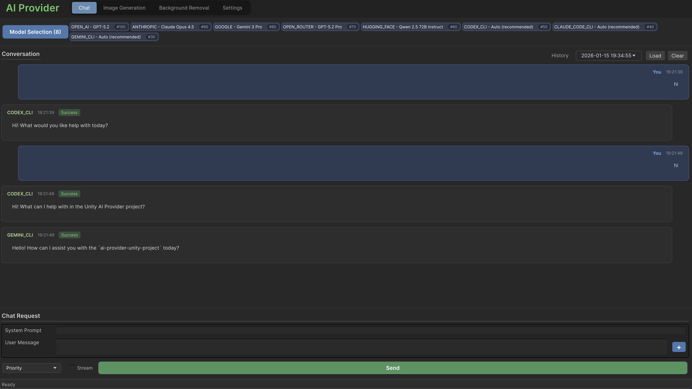
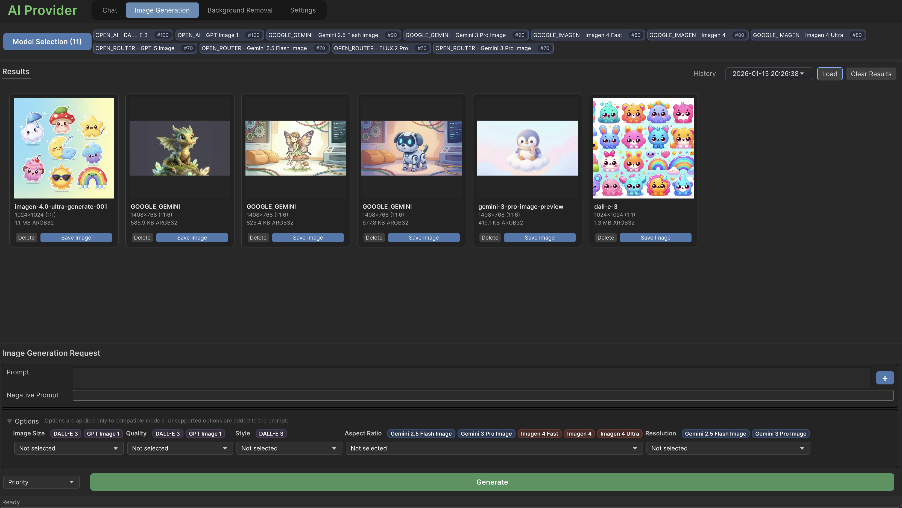
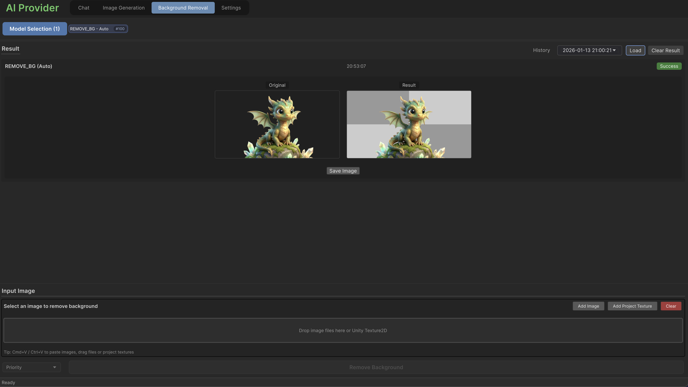
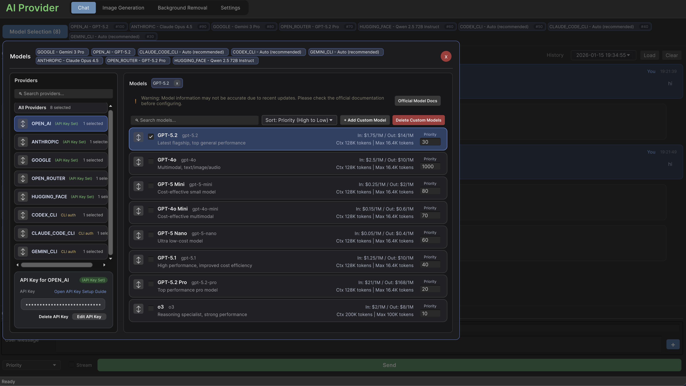
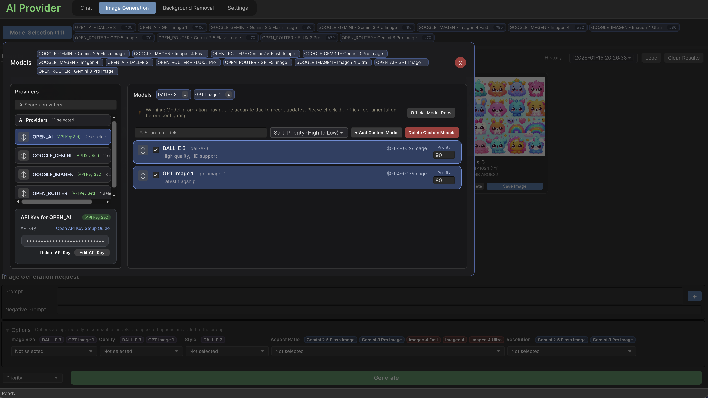
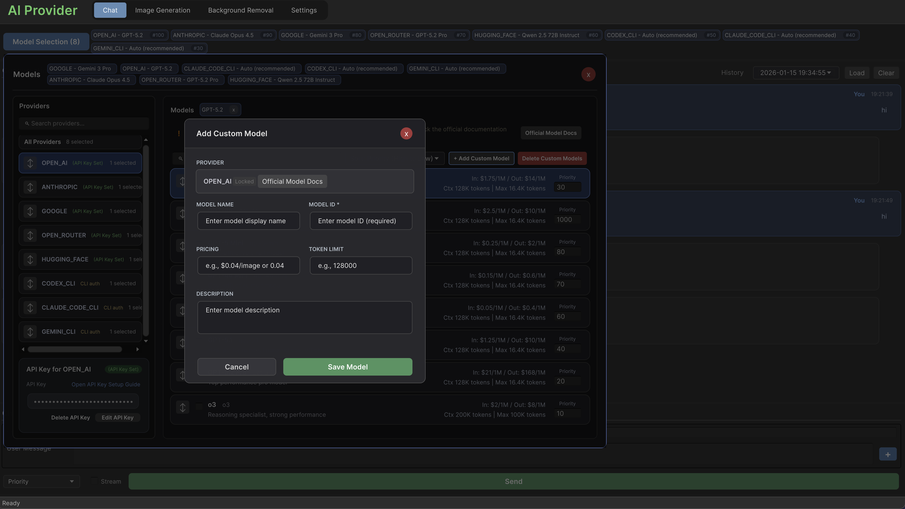

# Weppy AI Provider

Chat, 이미지 생성, 배경 제거를 위해 여러 AI 공급자(OpenAI, Google Gemini, Anthropic, HuggingFace, OpenRouter)를 통합하는 Unity 패키지입니다.

## 스크린샷

### Chat
> 멀티 프로바이더 채팅 (API & CLI), 스트리밍 지원



### 이미지 생성
> DALL-E, Imagen 등을 활용한 이미지 생성



### 배경 제거
> 원클릭 이미지 배경 제거



### 프로바이더 설정
> 에디터 창에서 프로바이더 및 모델 설정




### 커스텀 모델
> 가격 및 토큰 제한이 포함된 커스텀 모델 추가



## 주요 기능

- **Chat**: GPT-4, Gemini Pro, Claude 3 등을 위한 통합 API. 스트리밍 지원.
- **Image Generation**: DALL-E 3, Imagen.
- **Tools**: RemoveBg 기반 배경 제거.
- **Editor Integration**: Unity 에디터에서 직접 프롬프트 테스트.

## 설치 방법

### Git URL

1. Unity에서 **Window > Package Manager**를 엽니다.
2. **+** 버튼을 클릭하고 **Add package from git URL...**을 선택합니다.
3. 아래 URL을 붙여넣고 **Add**를 클릭합니다.

`https://github.com/hope1026/weppy-unity-package-aiprovider.git`

## 시작하기

```csharp
using UnityEngine;
using Weppy.AIProvider;

public class HelloAI : MonoBehaviour
{
    private async void Start()
    {
        using (ChatProviderManager manager = new ChatProviderManager())
        {
            manager.AddProvider(
                ChatProviderType.OPEN_AI,
                new ChatProviderSettings("sk-your-api-key")
                {
                    DefaultModel = "gpt-4o"
                });

            ChatRequestPayload payload = new ChatRequestPayload()
                .AddUserMessage("Hello!");

            ChatResponse response = await manager.SendMessageAsync(payload);
            Debug.Log(response.IsSuccess ? response.Content : response.ErrorMessage);
        }
    }
}
```

## 샘플

- `Samples~/SimpleChatApiSample`
- `Samples~/SimpleChatCliSample`
- `Samples~/SimpleImageSample`

## 문서

- [Index](index.md)
- [Getting Started](getting-started.md)
- [Chat API](chat.md)
- [Image Generation](image-generation.md)
- [Background Removal](bg-removal.md)
- [Editor Window](editor-window.md)

## 라이선스

[LICENSE.md](../../LICENSE.md)에서 라이선스 정보를 확인하세요.
